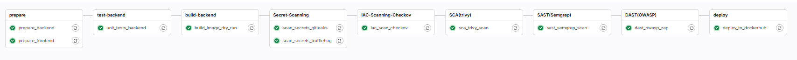
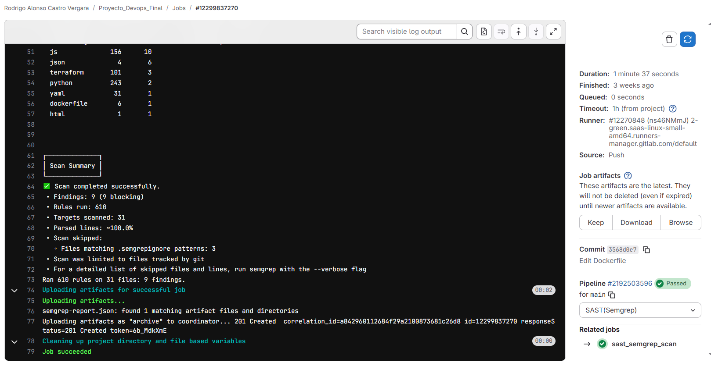

# DevSecOps POS: Secure CI/CD Pipeline Implementation


> **Implementación de un ciclo de vida de desarrollo seguro (SDLC) integrando herramientas de análisis estático, dinámico y de infraestructura en un pipeline automatizado.**

🔗 **Repositorio Original:** [Ver proyecto completo en GitLab](https://gitlab.com/rodrigo.castro.v/proyecto_devops_final)

---

## Resumen del Proyecto

Este proyecto demuestra la implementación práctica de la metodología **DevSecOps**. Se transformó un sistema de Punto de Venta (POS) monolítico en una arquitectura de microservicios contenerizada, protegida por un pipeline de CI/CD que audita automáticamente cada commit en busca de vulnerabilidades antes del despliegue.

El objetivo principal no es solo la funcionalidad del software, sino la integridad y seguridad de la cadena de suministro, mitigando riesgos desde el código fuente hasta la infraestructura.

---

## Arquitectura del Sistema

El sistema consta de un frontend en React y un backend en Flask, orquestados mediante Docker Compose y servidos a través de un proxy inverso Nginx.


---

## Pipeline de Seguridad (CI/CD)

El archivo `.gitlab-ci.yml` orquesta 9 etapas de validación. 



| Etapa | Herramienta | Tipo | Objetivo |
|-------|-------------|------|----------|
| **Secrets** | Gitleaks / TruffleHog | Pre-commit | Detectar API Keys o credenciales hardcodeadas. |
| **SCA** | Trivy | Dependencias | Escanear librerías vulnerables (CVEs) en Python/Node.js. |
| **SAST** | Semgrep | Código | Análisis estático para detectar patrones de código inseguro. |
| **IaC** | Checkov | Infraestructura | Auditoría de seguridad en Dockerfiles y Terraform. |
| **DAST** | OWASP ZAP | Dinámico | Ataque activo al contenedor en ejecución para detectar fallos reales. |

### Evidencia de Auditoría
Resultados reales de la ejecución del pipeline detectando y mitigando vulnerabilidades:



---

## Gestión de Vulnerabilidades y Mitigación

Durante el desarrollo se identificaron y corrigieron fallos críticos de seguridad:

### 1. Endurecimiento del Contenedor (Docker Security)
* **Hallazgo:** El contenedor backend se ejecutaba como usuario root.
* **Mitigación:** Implementación de usuario sin privilegios (appuser) en el Dockerfile para cumplir el principio de menor privilegio.

### 2. Protección de Cabeceras HTTP (Nginx Hardening)
* **Hallazgo:** OWASP ZAP detectó falta de cabeceras de seguridad y exposición de versión del servidor.
* **Mitigación:** Configuración de server_tokens off, implementación de CSP (Content Security Policy) estricto y bloqueo de características sensibles mediante Permissions-Policy.

### 3. Seguridad en la Aplicación (AppSec)
* **Hallazgo:** La aplicación Flask corría con debug=True en producción.
* **Mitigación:** Refactorización del entrypoint para usar variables de entorno y Gunicorn como servidor WSGI de producción.

---

## Ejecución Local

Sigue estos pasos para levantar el entorno completo (Backend + Frontend + DB + Nginx) en tu máquina.

### 1. Clonar el repositorio
```bash
git clone https://github.com/Sgarrido33/devsecops-pos-pipeline.git
cd devsecops-pos-pipeline
```

### 2. Configurar variables de entorno

Crea un archivo llamado .env en la raíz del proyecto. Puedes copiar el siguiente contenido base:

```bash
# Configuracion de Base de Datos
MYSQL_HOST=mysql
# Credenciales entorno de pruebas
MYSQL_USER=test_user
MYSQL_PASSWORD=test_password
MYSQL_DATABASE=test_db
MYSQL_ROOT_PASSWORD=root_password

# Configuracion CI/CD (Solo si ejecutas pipelines)
# Token para subir imágenes al registro (No necesario para ejecución local)
DOCKER_USER=tu_usuario_dockerhub
DOCKER_PASS=tu_token_dockerhub
```

### 3. Desplegar con Docker Compose
```bash
docker-compose up --build -d
```

La aplicación estará disponible en: http://localhost:80

## Tech Stack

* CI/CD: GitLab CI (Runners Docker-in-Docker)
* Contenedores: Docker, Docker Compose
* Backend: Python 3.10, Flask, Gunicorn
* Frontend: React, Vite, Pico.css
* Database: MySQL 5.7
* Proxy: Nginx (Hardened configuration)